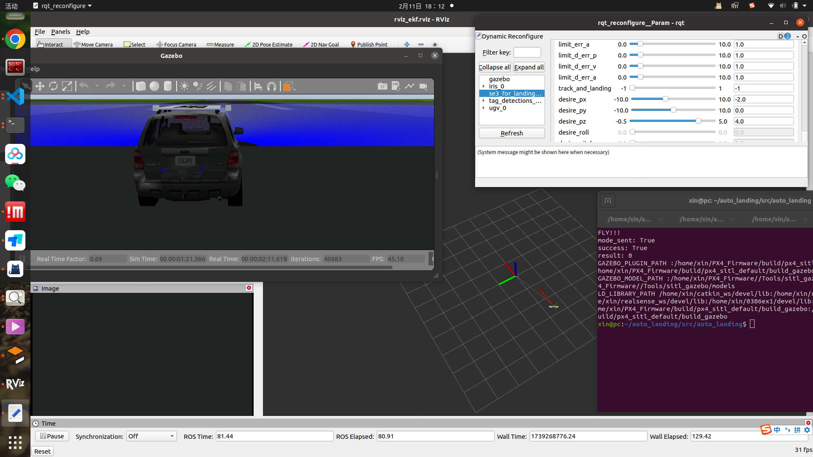
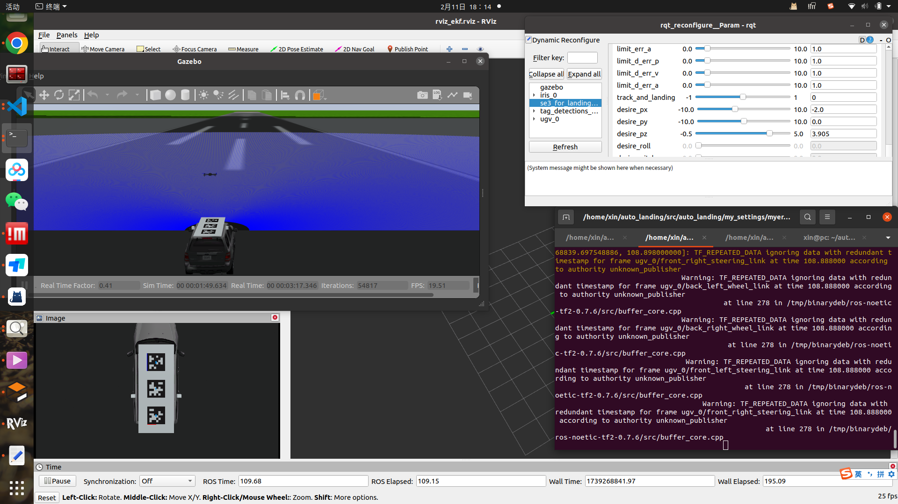
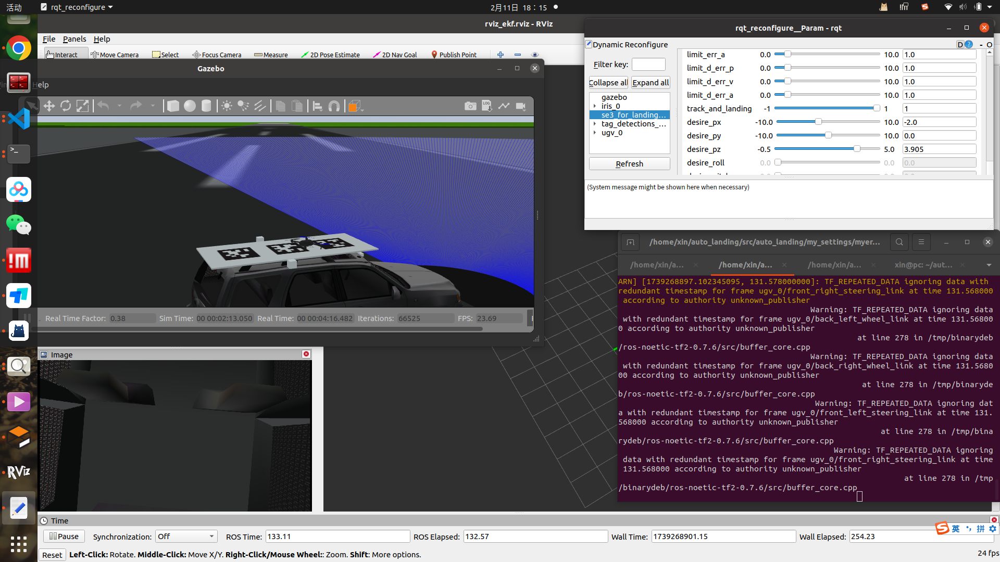

# auto_landing
## 说明
- 本科毕设仿真实验，MASLAB实验室github上有使用realsense455的[实机实验](https://github.com/HITSZ-MAS/auto_landing)代码， 环境是Ubuntu 20.04，仿真环境搭建参考 [XTDrone](https://github.com/robin-shaun/XTDrone/tree/master)
- 参考 [XTDrone使用文档](https://www.yuque.com/xtdrone/manual_cn) 中的[多无人机降落](https://www.yuque.com/xtdrone/manual_cn/precision_landing) 章节，本工作**主要贡献**：
    - 整合 起飞-追踪-着陆 全过程，使其可以在一个简易的UI上实现状态切换（rqt_reconfigure/Tune）。
    - 更换控制器为SE3控制器，无人机飞行更加稳定，替代原有简陋控制方案
    - 脚本实现一键启动
    - gazebo着陆场景搭建（单机单车场景）
- 由于是本科刚学习ROS的时候搞的项目，没有严格的代码管理。且着陆过程没有规划算法的加入，整体不够鲁棒。
- [我的XTDrone PX4_Firmware 工程文件 论文文件](https://pan.baidu.com/s/1nRMLu1X8nQfmc9oagIE2JA) ，提取码：0206。

---

## 环境配置
<!-- - **建议先跑通XTDrone[多无人机降落](https://www.yuque.com/xtdrone/manual_cn/precision_landing)历程** -->
- 参考[仿真平台基础配置（对应PX4 1.13版](https://www.yuque.com/xtdrone/manual_cn/basic_config_13) 安装 mavros 和 PX4 等依赖
- `cd /path/to/your/directory` （我的是`auto_landing`）
- `mkdir src && cd src`
- `git clone https://github.com/STUDYXIN/auto_landing.git`
- `cd auto_landing`
- `cp mylanding2.launch ~/PX4_Firmware/launch`
- `cd ../../`
- `catkin_make`

---

## 运行
- 在终端打开本项目文件夹(`auto_landing`)
- `sudo chmod +x quick_start.sh`(第一次使用)
- `./quick_start.sh`
- 如果一切顺利，此时无人机已经起飞了。如果没有，看看哪个终端没启动或者报错了 
- 这时候在`rqt_reconfigure__Param - rqt`找到 `track_and_landing` `desire_px` 这些变量附近，**小幅度拖动下面的进度条**，比如把`desire_pz`大小拉大一点。(这一步的目的是让飞机飞到（-2.0 0.0 4.0）这个点，可以看到二维码，也可以设置为其他点。理论上初始就是这个值就正确，但是rqt_reconfigure需要拖动才能发送数据，所以小范围拖动即可。)
- `track_and_landing` 拨到**中间**，开始追踪模式
- 调到第二个终端界面，这里可以按 w x a d 控制车动，s车停。
- **车停止后**，`track_and_landing` 拨到最右半（1），着陆。

---

仅供学习参考

